# BME-450-Project-1

Code Link: https://github.com/SamEF99/BME-450-Project-1/blob/master/BME%20450%20Project%20%231.ipynb

# Problem Statement:

  For this project, we need code that will use M2M to analyze data from the Ocean Observatories Initiative. We will need to pull data for 24 hour periods of collection for both winter and summer from seven different arrays split between the Coastal Endurance and Cabled Array sites. From that data, we need to calculate the number of dives, plot the speed of sound profile (speed of sound v.s. depth), and calculate and plot the average ssp. Finally, we need to answer several questions comparing profilers by depth, ssp, time, season, and location.
  
# The Code:

  The code works by allowing user input to create a URL to the OOI website and retrieve data. The user chooses an array, a start and end date, and a start and end time, all in Pacific Standard. The code then takes this information and uses it to construct a URL. It first converts the input to UTC, by switching the formatting to a datetime file, using a conversion function, then switching the formatting back to the URL format. Next, the function URL_Builder creates a URL from the input, and that URL is used to send a request for the data and present it to the user. The code then defines two functions, one to convert the OOI timestamp into UTC, then PST time in a readable format, the other to count the number of dives taken in the data. The code then uses two for loops to choose the columns of data that will be needed to read data and calculate ssp. An array and an if statement define the plot title that will be used later. Next, a for loop appends the data chosen earlier into variables for plotting, and checks if the data is reasonable. If not, it will redefine the columns it is pulling data from. We then calculate the speed of sound, and make a polyfit curve for the ssp and depth data. Finally, the code plots two graphs, one of the speed of sound profile with the average, the other with ssp over time to see changes over the time period, and calculates the number of dives based on how often it reaches a maximum depth.

# Results:

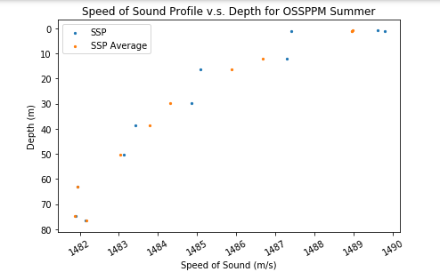

Dives: 2

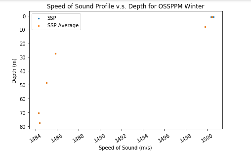

Dives: 1

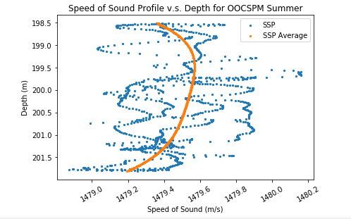

Dives: 9

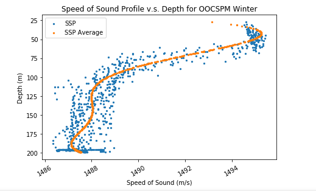

Dives: 9

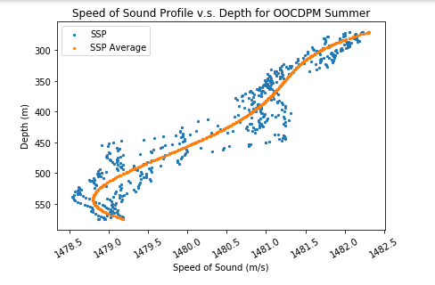

Dives: 2

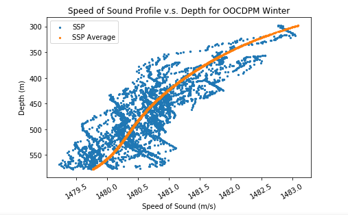

Dives: 12

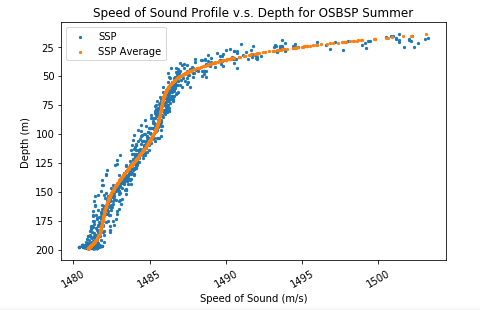

Dives: 9

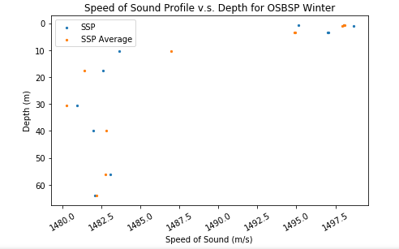

Dives: 1

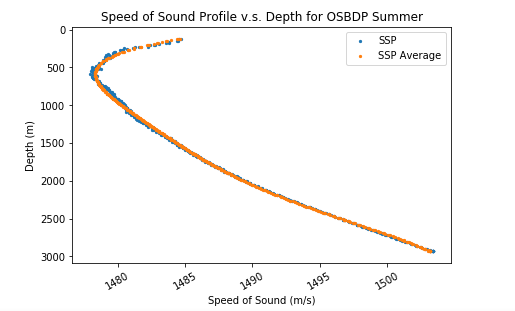

Dives: 2

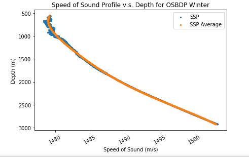

Dives: 2

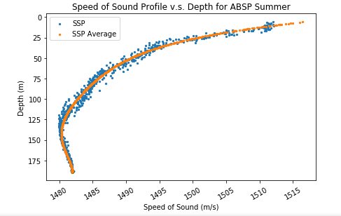

Dives: 9

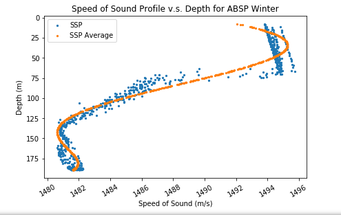

Dives: 9

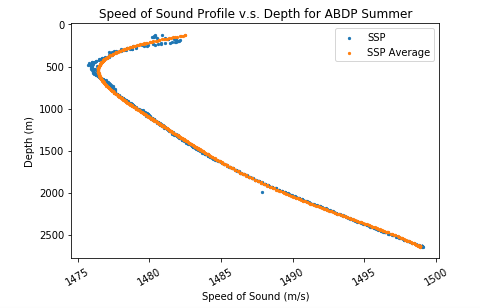

Dives: 2

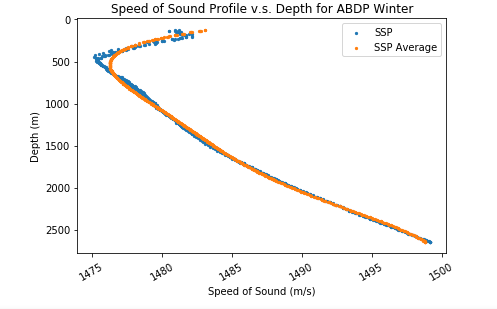

Dives: 2

# Questions:

a.) Compare the number of dives per day of the shallow profiler vs deep profiler.

  Overall, the number of dives tended to be much higher for the shallow profiler than the deep profiler. This is best shown in the data for the shallow and deep Axial Base Profilers, which had 2 dives for the deep profiler and 9 for the shallow. This makes sense, as the sensor would take much longer to travel the depth required for the deep profiler, therefore making less dives in the same amount of time.

b). Where is the maximum value of ssp in each season? Explain why the max ssp should be there?

  In the shallow profilers, we see that the maximum ssp is present at the surface in both winter and summer, due to the greater heat at the surface. However, during summer the maximum value is higher, likely due to the higher temperatures in this season. For the deep profilers, we see that the maximum ssp is deep down, and is even higher than the surface ssp. This is due to the increasing pressure that makes up for the colder temperatures.

c). Compare the ssp profile in day and night of all profilers, explain what you find(effect of day vs night).

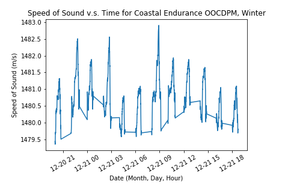

  As we can see in the example plot provided, the ssp for different times of day has two peaks and two valleys. It tends to be higher around midday and midnight, and grow lower around morning and evening. This could be due to changing temperature, which will be at its hot and cold extremes during the ssp peaks, and at moderate levels during the ssp low points. This will alter the density properties of the seawater, changing the ssp. This trend tends to be consistent across profilers.

d). Compare the ssp profile in summer and winter of all profilers, explain what you find(effect of season).

  For the same arrays, the general trend of the ssp profile is similar between seasons, but differs slightly in magnitude. In summer, the ssp at the surface is higher than that of the winter, but at lower depths, they end up at nearly the same value. In some profiles, we can even see a sharp decrease in ssp at the surface to the more extreme cold, before returning to the standard profile expected as the depth increases.

e). Compare the average ssp profiles of all profilers recorded at the same day in winter and summer (effect of location).

  I had some difficulty in finding available data that overlapped between different sensors, but for those that did, such as the Axial Base Profilers, we can see that very little difference occurs between location for the same day. There are small differences in the magnitude of the ssp for shallow profilers, probably due to slightly different weather conditions that change temperatures at the surface. For the deep profilers, there is almost no noticeable difference between the locations. Location trends would probably be more noticeable at arrays that are stationed farther apart, as all the analyzed stations are located in the PNW.
